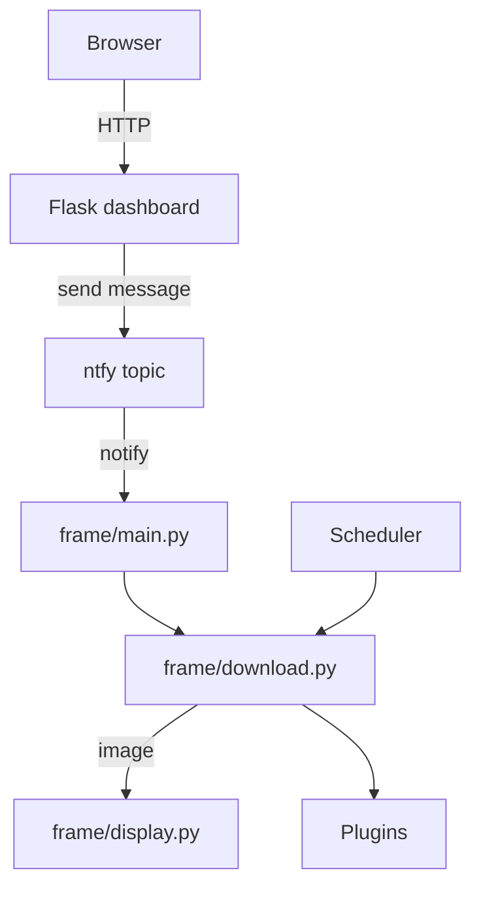

# Frame for Raspberry Pi 🖼️

A pluggable image frame built on Flask and a Waveshare e‑Ink display. The dashboard lets you upload pictures, fetch them from external services, and trigger refreshes either manually or on a schedule.

## Features
- Web dashboard for uploading images and managing configuration
- Pluggable image sources (DeviantArt, Plex, fixed images, or custom plugins)
- Optional scheduler for periodic refreshes
- REST API protected by bearer token
- Runs on Raspberry Pi with Waveshare e‑Ink display

## Architecture


## Quickstart
1. **Clone and enter the repository**
   ```bash
   git clone https://github.com/your-user/Frame.git
   cd Frame
   ```
2. **(Optional) Create a virtual environment**
   ```bash
   python -m venv .venv
   source .venv/bin/activate
   ```
3. **Install dependencies**
   ```bash
   pip install -r requirements.txt
   ```
4. **Configure environment variables**
   ```bash
   cp .env.example .env
   # edit .env with your API_TOKEN, NTFY_URL, DeviantArt and Plex credentials, etc.
   ```
5. **Run the dashboard**
   ```bash
   python dashboard.py
   ```
   Visit http://localhost:5000 to use the web interface.

## Configuration
Environment variables loaded from `.env` control behaviour:

| Variable | Description |
|---|---|
| `API_TOKEN` | Bearer token required for API requests |
| `NTFY_URL` | ntfy topic used to signal frame updates |
| `DEVIANTART_CLIENT_ID`, `DEVIANTART_CLIENT_SECRET` | DeviantArt credentials |
| `PLEX_URL`, `PLEX_TOKEN`, `PLEX_LIBRARY` | Plex server info |
| `UPDATE_INTERVAL` | Seconds between automatic refreshes (0 disables scheduler) |

## Development
Run linting and tests before committing:

```bash
python -m py_compile dashboard.py frame/*.py
flake8 .
mypy .
pytest
```

## Deployment
### install.sh
On Raspberry Pi, run:

```bash
sudo ./install.sh
```

### Docker
Build and run inside a container:

```bash
docker build -t frame .
docker run --env-file .env -p 5000:5000 frame
```

## Extending
Create a module that downloads an image and register it:

```python
from frame.plugins import register_plugin

def my_source(destination: str) -> None:
    # download image to destination

register_plugin("my_source", my_source)
```

## License
[MIT](LICENSE)

Merci et bonne journée !
