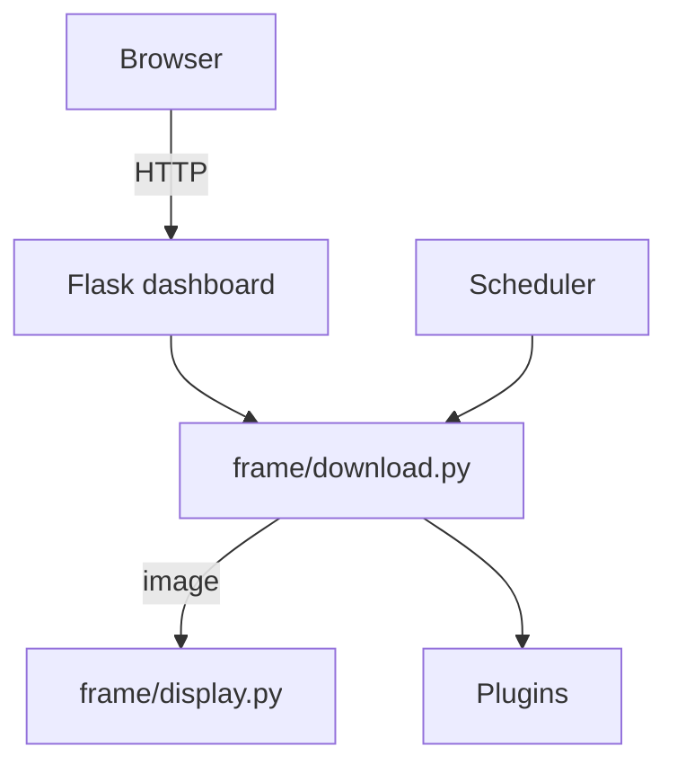

# Frame for Raspberry Pi 🖼️

A pluggable image frame built on Flask and a Waveshare e‑Ink display. The dashboard lets you upload pictures, fetch them from external services, and trigger refreshes either manually or on a schedule.

## Features
- Web dashboard for uploading images and managing configuration
- Pluggable image sources (DeviantArt, Plex, fixed images, or custom plugins)
- Optional scheduler for periodic refreshes
- REST API protected by bearer token
- Runs on Raspberry Pi with Waveshare e‑Ink display
- Initial web-based setup for easy configuration
- Support for multiple environment files

## Architecture


## Quickstart
1. **Clone and enter the repository**
   ```bash
   git clone https://github.com/your-user/Frame.git
   cd Frame
   ```
2. **(Optional) Create a virtual environment**
   ```bash
   python -m venv .venv
   source .venv/bin/activate
   ```
3. **Install dependencies**
   ```bash
   pip install -r requirements.txt
   ```
4. **Run the dashboard**
   ```bash
   python dashboard.py
   ```
5. **Configure via web interface**
   Visit http://localhost:5000 to access the initial setup wizard.

## Configuration
Environment variables control behaviour. On first access, you'll be guided through a web-based setup process to configure these variables.

Alternatively, you can manually create a `.env` file:
```bash
cp .env.example .env
# edit .env with your API_TOKEN, DeviantArt and Plex credentials, etc.
```

| Variable | Description |
|---|---|
| `API_TOKEN` | Bearer token required for API requests |
| `DEVIANTART_CLIENT_ID`, `DEVIANTART_CLIENT_SECRET` | DeviantArt credentials |
| `PLEX_URL`, `PLEX_TOKEN`, `PLEX_LIBRARY` | Plex server info |
| `UPDATE_INTERVAL` | Seconds between automatic refreshes (0 disables scheduler)

### Multiple Environment Files
You can use different environment files by setting the `ENV_FILE` environment variable:
```bash
ENV_FILE=.env.production python dashboard.py
```

## Getting Your API Token

After initial setup, you can find your API token in two ways:

1. **Via the web interface**: Navigate to the "API Token" page in the dashboard to view and copy your token.

2. **Via the API**: If you know your current token, you can retrieve it with:
   ```bash
   curl -H 'Authorization: Bearer YOUR_CURRENT_TOKEN' http://your-frame-ip:5000/api/token
   ```

During the initial setup, if you don't provide an API token, a secure one will be automatically generated for you.

## API Usage

The Frame API is protected by a bearer token that you set during the initial configuration. Include this token in the `Authorization` header of your requests:

```
Authorization: Bearer YOUR_API_TOKEN
```

### Upload Image from URL

You can upload an image to the frame by providing a URL to the image:

```bash
curl -X POST \
  http://your-frame-ip:5000/api/upload_url \
  -H 'Authorization: Bearer YOUR_API_TOKEN' \
  -H 'Content-Type: application/json' \
  -d '{"url": "https://example.com/image.jpg"}'
```

### Upload Image File

You can also upload an image file directly:

```bash
curl -X POST \
  http://your-frame-ip:5000/api/upload \
  -H 'Authorization: Bearer YOUR_API_TOKEN' \
  -F 'image=@/path/to/your/image.jpg'
```

### Trigger Image Update

To trigger an immediate update of the frame display:

```bash
curl -X POST \
  http://your-frame-ip:5000/api/new \
  -H 'Authorization: Bearer YOUR_API_TOKEN'
```

### Set Image Source

You can configure which image source the frame should use (DeviantArt, Plex, or fixed):

```bash
curl -X POST \
  http://your-frame-ip:5000/api/function \
  -H 'Authorization: Bearer YOUR_API_TOKEN' \
  -H 'Content-Type: application/json' \
  -d '{"function": "DeviantArt"}'
```

Replace `"DeviantArt"` with `"plex"` or `"fixed"` as needed.

## Development

### Running Tests

The project includes automated tests to ensure everything works correctly:

```bash
# Run all tests
pytest

# Run specific test files
python -m pytest tests/test_app.py -v
python -m pytest tests/test_upload_api.py -v
```

### Code Quality Checks

Before committing, run these checks:

```bash
# Check Python syntax
python -m py_compile dashboard.py frame/*.py

# Linting
flake8 .

# Type checking
mypy .

# Format code (optional)
black tests
```

### Continuous Integration

This project uses GitHub Actions for continuous integration. The CI workflow runs automatically on every push and pull request, performing these checks:

1. Install dependencies
2. Check Python syntax
3. Run linting (flake8, black)
4. Run type checking (mypy)
5. Run unit tests (pytest)
6. Test application startup
7. Test application functionality

You can view the CI status in the "Actions" tab of the GitHub repository.

## Deployment
### install.sh
On Raspberry Pi, run:

```bash
sudo ./install.sh
```

### Docker
Build and run inside a container:

```bash
docker build -t frame .
docker run --env-file .env -p 5000:5000 frame
```

## Extending
Create a module that downloads an image and register it:

```python
from frame.plugins import register_plugin

def my_source(destination: str) -> None:
    # download image to destination

register_plugin("my_source", my_source)
```

## License
[MIT](LICENSE)

Merci et bonne journée !
